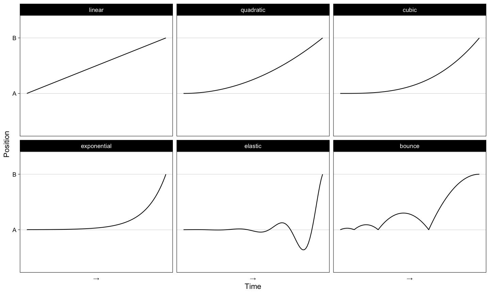
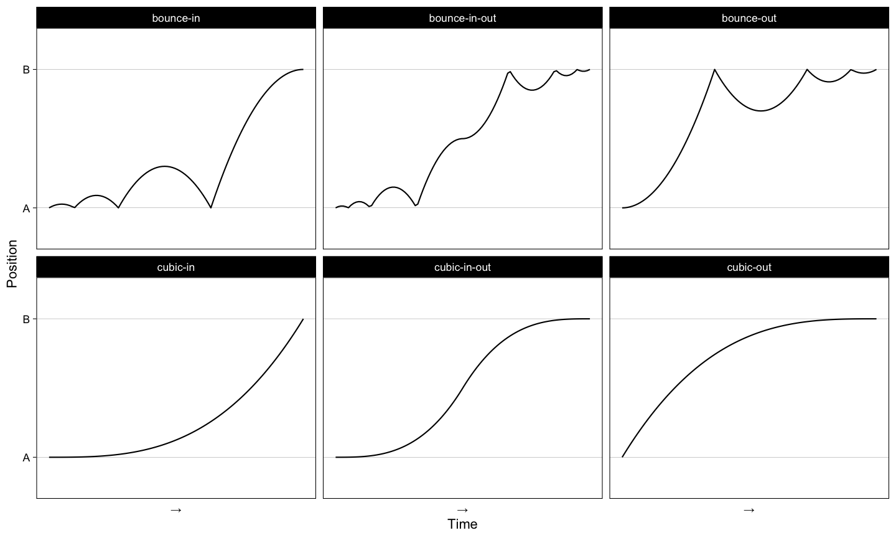

---
# Please do not edit this file directly; it is auto generated.
# Instead, please edit 02-Controlling-animations.md in _episodes_rmd/
title: Controlling animation options
teaching: 45
exercises: 45
questions:
- "How can I control the animations transitions?"
- "How do I save animations?"
objectives:
- "To explore different ways to control animation transitions."
keypoints:
- "Control how transitions occur using easings, shadows, enters and exits"
- "Animations can be saved with `anim_save()`"
source: Rmd
---

# Controlling the transitions

The transitions provide the functional element of your animation, by allowing you to display different
aspects of your data. There are several other additions to the `gganimate` grammar that fall more towards
the visually appealing end of the spectrum than functional. These additional layers provide control
over *how* the transitions are shown, rather than *what* the transitions are.

# Easing

Easings define how a value changes from one point to another during a transition. The default easing
that has been applied to all our animations so far is a linear one. Each point moves from A to B in 
a linear fashion over time. There are different easings that you can apply to your animation however,
and these can give the impression of acceleration/deceleration to your points or even more complicated
relationships such as an elastic release.

These easings can take modifiers as well. Each of the easings above is the `-in` version, and can be 
reversed by using the `-out` version. Or these can be combined in an `-in-out` version which provides
the easing effect both going into and out of the transition.

~~~
tibble(Time = seq(1,2, length.out = 100)) %>% 
  mutate(
    `cubic-in` = tweenr::tween_numeric(1:2, 100, "cubic-in")[[1]],
    `cubic-out` = tweenr::tween_numeric(1:2, 100, "cubic-out")[[1]],
   `cubic-in-out` = tweenr::tween_numeric(1:2, 100, "cubic-in-out")[[1]],
    `bounce-in` = tweenr::tween_numeric(1:2, 100, "bounce-in")[[1]],
    `bounce-out` = tweenr::tween_numeric(1:2, 100, "bounce-out")[[1]],
   `bounce-in-out` = tweenr::tween_numeric(1:2, 100, "bounce-in-out")[[1]]
  ) %>% 
  gather(easing, Position, -Time) %>% 
  #mutate(easing = factor(easing, levels = c("","quadratic","cubic","exponential","elastic","bounce"))) %>% 
  ggplot(aes(Time, Position)) + 
  geom_line() +
  facet_wrap(~easing) +
  theme_linedraw() +
  scale_y_continuous(breaks = 1:2, labels = c("A","B"), expand = c(0.3,0)) +
  scale_x_continuous(breaks = 1.5, labels = "→") +
  theme(panel.grid.minor = element_blank(), panel.grid.major.x = element_blank(), axis.ticks.x = element_blank())
~~~
{: .language-r}

Applying these easings to your aesthetic transitions is done by adding an `ease_aes()` layer with 
the name of the easing you wish to apply.

~~~
iris_anim <- ggplot(iris, aes(x = Petal.Width, y = Sepal.Length)) +
  geom_point() +
  transition_states(Species)

#default
iris_anim + ease_aes("linear")
~~~
{: .language-r}

~~~
#cubic-in
iris_anim + ease_aes("cubic-in")
~~~
{: .language-r}

~~~
#bounce-in
iris_anim + ease_aes("bounce-in")
~~~
{: .language-r}

~~~
#cubic-in-out
iris_anim + ease_aes("cubic-in-out")
~~~
{: .language-r}

You can even specify separate easings for *any* aesthetic in your animation. x/y/colour/size/etc.

~~~
iris_anim + ease_aes(x = "cubic-in-out", y = "elastic-in")
~~~
{: .language-r}

# Shadows

Shadows provide a way to retain some history of prior frames in the current one. The data from old
frames will be superimposed on the new one, and may be visually diminished to show it's decreasing
importance to the current state.

`shadow_trail()` produces evenly spaced snapshots of the data across the transition and retains them
on future frames. You can modify the aesthetics of this trail to make it stand out from the current 
frame's data.

~~~
iris_anim <- ggplot(iris, aes(x = Petal.Width, y = Sepal.Length)) +
  geom_point() +
  transition_states(Species)

iris_anim + shadow_trail(size = size/4, colour = "grey70")
~~~
{: .language-r}

`shadow_wake()` produces a short history of a transition, showing the previous few frames worth of data
along with the current. The only required argument for this function is what proportion (from 0 to 1)
of the animation is contained in the wake. You can again modify the aesthetics of this wake to have 
it diminish over time.

~~~
iris_anim + shadow_wake(wake_length = 0.2)
~~~
{: .language-r}

# Data entry and exit
So far, we have been dealing with data that is complete and does not have any missing values. If this
is not the case for your data, you might notice odd occurrances when data needs to enter or exit the
animation. Elements of your plot will just suddenly appear or disappear in ways that may be confusing.

~~~
cars_anim <- ggplot(mtcars, aes(wt, mpg)) +
  geom_point() +
  transition_states(gear, 2, 1)

cars_anim
~~~
{: .language-r}

To specify exactly how data enters or exits your animation, there are several `enter_` and `exit_`
functions:

~~~
cars_anim +
  enter_grow() +
  exit_fly(x_loc = 1, y_loc = 9)
~~~
{: .language-r}

There are several varieties of enter/exit functions which you can read more about in the help page for
any of the functions. Some examples you might wish to use include:

* **appear/disappear**: Suddenly blink into or out of existance. The default response.
* **fade**: Fades in or out by setting the opacity of the element to zero
* **grow/shrink**: Changes the size of the element so it grows/shrinks to a zero size.
* **fly**: Moves to/from a *specific* x/y coordinate.
* **drift**: Moves to/from a *relative* x/y coordinate

These functions can be combined to achieve the desired effect.

~~~
cars_anim +
  enter_grow() +
  enter_drift(x_mod = 1) +
  exit_fly(x_loc = 1, y_loc = 9) +
  exit_shrink()
~~~
{: .language-r}

> ## Touching up gapminder
> 
> Experiment with your gapminder animation by adding some easings and a shadow. Is there a combination
> that feels 'best' for you?
{: .challenge}

> ## Stormy weather (optional)
> 
> Produce an animation from the inbuilt `storms` data frame, containing data on hurricanes in the 
> Atlantic Ocean.
> 
> In order to do this, consider
> * What does the static version of your animation look like?
> * What transition do you require, and what determines the different states you are transitioning between?
> * Can easings or shadows help make your animation more pleassing to view
> * Do you need to worry about how data enters or exits your visualisation?
>
> Feel free to come up with your own animation, but if you need some inspiration continue on from 
> the following template
>
>~~~
>storms_with_dates <- mutate(storms, datetime = lubridate::ymd_h(paste(year, month, day, hour)))
>
>ggplot(storms_with_dates, aes(x = long, y = lat, group = name)) +
>  ... +
>  transition_time(datetime)
>~~~
>{: .language-r}
{: .challenge}

# Saving animations

### Controlling quality
To gain greater control over how your animation is rendered, use the `animate()` function. This function
is called silently with default parameters whenever a gganimate objected is printed. These defaults 
are designed to trade off animation quality for rendering speed to allow interactive exploration in 
the console. You may want to change these defaults when it comes time to produce a final animation.

Remember this previous animation, where the default parameters didn't produce a nice result

~~~~~
animate(airqual_anim)
~~~~~
{: .language-r}

We can increase the quality of the animation (at the cost of rendering time and file size) buy 
adjusting some of the parameters to `animate()`

~~~~~
high_quality <- animate(airqual_anim, nframes = 300, fps = 30, height = 900, width = 1200, res = 300)

high_quality
~~~~~
{: .language-r}

{: .class="fig-responsive" style="max-width:40%;"}

### Saving to file

Once you are happy with your animation, it can be saved out to a file with `anim_save()`. This function
takes the file path to save your animation and the animation itself (or defaults to the last animation
printed, like `ggsave()`).
