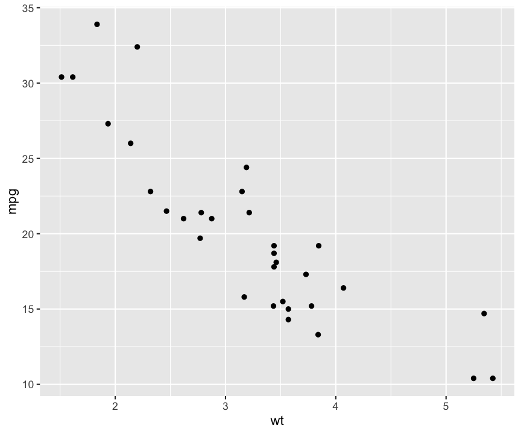

---
# Please do not edit this file directly; it is auto generated.
# Instead, please edit 04-Using-interactive-elements.md in _episodes_rmd/
title: Quick and easy interactivity
teaching: 45
exercises: 30
questions:
- "How do I use Shiny in R Markdown documents?"
- "How can I share Shiny apps?"
objectives:
- "To create interactive documents"
- "To understand how to host interactive applications"
keypoints:
- "`runtime: shiny` in the R Markdown header will enable using `shiny` components"
- "You do not need to worry about the ui.r file in this case"
- "You need a computer running R as the server to share Shiny apps"
source: Rmd
---

You may have realised in the previous introduction to Shiny that an interactive application can quickly
become a complex beast. if you wish to take your Shiny understanding further there are written and 
video [tutorials](http://shiny.rstudio.com/tutorial/) available that take you through the basics in 
a more detailed way.

For now however, we can discuss a few options for getting the most out of interactivity without having 
to go deeper down the rabbit hole.

# Interactive documents

It is possible to use Shiny components in an R Markdown document to add elements of interactivity
to your reports. This reduces a lot of the complexity of a Shiny app because the R Markdown document
handles most of the UI elements for you, leaving you to focus on the connecting the reactive elements.

In order to create an interactive R Markdown document, you need to add the following to the header 
block:

~~~~~
-----
runtime: shiny
-----
~~~~~
{: .language-r}

This will turn your document from a static to an interactive version. Since this interactive version
is now a Shiny app, you must be rendering to an HTML output such as `html_document`. 

To add input components to the document, you place them where you want them to appear with
the `____Input()` functions, exactly as with a regular Shiny app. The values of these inputs are 
accessed through the `input` object as before too.

To add a reactive output, you place them directly by using one of the `render____()` functions. Within
the render function you can refer to any of the input values from the entire document. There is no
need to save the result into the `output` object, or create a UI output. These are managed for you
automatically.

As a demonstration, creating the example app in R Markdown would look something like this:

<pre class="highlight"><code>---
output: html_document
runtime: shiny
---

&#96;&#96;&#96;{r}
sliderInput("bins", "Number of bins:", min = 1, max = 50, value = 30)

renderPlot({
        x    <- faithful[, 2]
        bins <- seq(min(x), max(x), length.out = input$bins + 1)
        
        hist(x, breaks = bins, col = 'darkgray', border = 'white')
    })
&#96;&#96;&#96;
</code></pre>

Interactive R Markdown documents will never be as fully featured or customisable as a normal Shiny
app. But they do provide an option to enhance your documents with small elements of interactivity 
without requiring the whole infrastructure of a complete app.

## Interactive plots

Alternatively, you may not be interested in a complete interactive application. Just in a single plot
that a user can explore on their own. While there are [some possibilities](http://shiny.rstudio.com/gallery/plot-interaction-exclude.html)
for direct interaction with plots produced in R using Shiny, there are also packages that allow you
to make use of [JavaScript visualisation libraries](http://www.htmlwidgets.org/index.html) to make 
truly interactive plots from within R.

The easiest of these to get started with is probably the `plotly` package which uses the [plot.ly](https://plot.ly)
library. This has a `ggplotly()` function which takes a ggplot object and converts it into an
interactive HTML plot.

~~~
cars <- mtcars %>% 
  rownames_to_column("car_name") %>% 
  mutate(cyl = as.factor(cyl))

car_plot <- ggplot(cars, aes(x = wt, y = mpg)) + 
  geom_point()

car_plot
~~~
{: .language-r}

~~~
ggplotly(car_plot)
~~~
{: .language-r}

<iframe src="{{page.root}}/data/plotly_basic_example.html" width="50%" height="400px" style="display: block; margin: auto"></iframe>

By default, plotly will include any mapped aesthetic value in the tooltip for each point:

~~~
colourful_plot <- ggplot(cars, aes(x = wt, y = mpg, colour = cyl)) + 
  geom_point()

ggplotly(colourful_plot)
~~~
{: .language-r}

<iframe src="{{page.root}}/data/plotly_colours_example.html" width="50%" height="400px" style="display: block; margin: auto"></iframe>

But the tooltip can be provided directly using the `text` aesthetic in your plotting code (which has
no function in a regular ggplot plot) and the `tooltip` argument of `ggplotly()`.

~~~
tooltip_plot <- ggplot(cars, aes(x = wt, y = mpg, colour = cyl, text = car_name)) + 
  geom_point()

ggplotly(tooltip_plot, tooltip = "text")
~~~
{: .language-r}

<iframe src="{{page.root}}/data/plotly_tooltip_example.html" width="50%" height="400px" style="display: block; margin: auto"></iframe>

These interactive visualisations can be standalone or created as part of an R Markdown document 
without needing a complete Shiny app behind them. Or you can integrate them *into* a Shiny app by 
using the `plotlyOutput()`/`renderPlotly()` functions from the `plotly` package.

# Sharing your creations

Running your Shiny application requires an active connection to an R session to run your server code.
This is not an issue when developing your app, because your computer acts as the server. It can pose
some difficulties when sharing your app however.

Your options for sharing essentially fall into two categories

### Your user runs it

You rely on your end users to run the code on their own computer that has R and all the necesssary
packages installed.

This might involve emailing them the files for the app, or putting it somewhere else in an accessible
place. If you are using GitHub for version control, the most recent version of your app can be downloaded
and run by using the `runGitHub()` function. Try `runGitHub("rstudio/shiny_example")` for an example 
of this in action.

### Find a server to run it

You install your app on a web server that has R and all the necessary packages installed. That server
is responsible for running your app when a user visits the site.

There are a few options for how this can work. RStudio has a service at [shinyapps.io](https://www.shinyapps.io) 
that lets you upload apps directly from within RStudio. Many instutions will have their own Shiny
servers that can be used. Or if you are feeling adventurous you can even try 
[doing it yourself](https://deanattali.com/2015/05/09/setup-rstudio-shiny-server-digital-ocean/).
